<h3><code>pileup@github ~ $ ./shipped.sh</code></h3>

<table>
  <tr>
    <td valign="top"></td>
    <td valign="top"></td>
  </tr>
</table>

 

<h3><code>pileup@github ~ $ ls ./plugins</code></h3>

Six Minecraft plugins for Paper 1.21, around 45,000 lines of Java. Full write up in [minecraft-plugins](https://github.com/PileUpDigital/minecraft-plugins).

| Plugin | What it does | Lines |
|---|---|---:|
| [LegendaryWeapons](https://github.com/PileUpDigital/LegendaryWeapons) | Artifact weapons that spawn on pedestals in world structures | 12,719 |
| [TemporalGear](https://github.com/PileUpDigital/TemporalGear) | Items that expire on a real world clock | 8,921 |
| [TagsPlugin](https://github.com/PileUpDigital/TagsPlugin) | Animated chat tags with three storage backends | 8,806 |
| [WeeklyChallenges](https://github.com/PileUpDigital/WeeklyChallenges) | Weekly resetting challenges with leaderboards | 7,906 |
| [PlayerMarket](https://github.com/PileUpDigital/PlayerMarket) | Player run marketplace with transactional purchases | 5,521 |
| [MinesPlugin](https://github.com/PileUpDigital/MinesPlugin) | Minesweeper wagering game | 1,529 |

<h3><code>pileup@github ~ $ cat ./bugme</code></h3>

[BugMe](https://trybugme.com) is a reminder app for people whose reminders stop working after the second snooze. It escalates through twelve tiers, from a quiet nudge up to critical alerts and app blocking, and it keeps going until the task is actually done.

Live on the App Store. Swift and SwiftUI, StoreKit 2 for subscriptions, a Node backend, and a DeviceActivityMonitor extension for scheduled blocking.

<h3><code>pileup@github ~ $ whoami</code></h3>

PileUp Digital is a one person software studio registered in Wyoming. I build small products end to end: the app, the backend, the payments, the site.

Work with me at [pileupdigital.com](https://pileupdigital.com).

 
The card above regenerates daily from the GitHub API. The ASCII mark is rendered from <code>assets/mark.png</code> by the scripts in <code>scripts/</code>.

